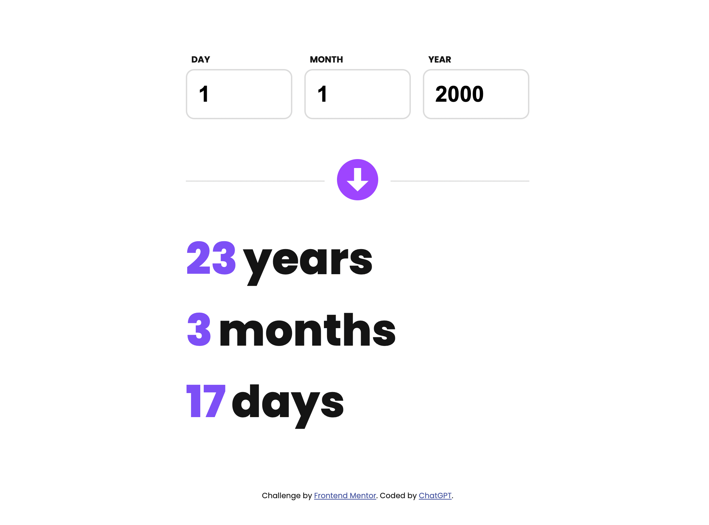
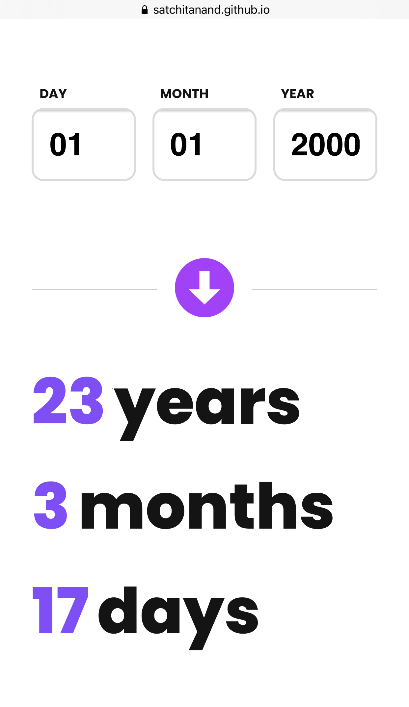

# Frontend Mentor - Age calculator app solution

This is a solution to the [Age calculator app challenge on Frontend Mentor](https://www.frontendmentor.io/challenges/age-calculator-app-dF9DFFpj-Q). Frontend Mentor challenges help you improve your coding skills by building realistic projects. 

## Table of contents

- [Overview](#overview)
  - [The challenge](#the-challenge)
  - [Screenshot](#screenshot)
  - [Links](#links)
- [My process](#my-process)
  - [Built with](#built-with)
  - [What I learned](#what-i-learned)
  - [Continued development](#continued-development)
  - [Useful resources](#useful-resources)
- [Author](#author)
- [Acknowledgments](#acknowledgments)

## Overview

### The challenge

Users should be able to:

- View an age in years, months, and days after submitting a valid date through the form
- Receive validation errors if:
  - Any field is empty when the form is submitted
  - The day number is not between 1-31
  - The month number is not between 1-12
  - The year is in the future
  - The date is invalid e.g. 31/04/1991 (there are 30 days in April) -- not implemented yet!
- View the optimal layout for the interface depending on their device's screen size
- See hover and focus states for all interactive elements on the page
- **Bonus**: See the age numbers animate to their final number when the form is submitted -- not implemented yet!

### Screenshot




### Links

- Solution URL: [Age Calculator App Solution](https://github.com/satchitanand/001_Age_Calculator_App)
- Live Site URL: [Age Calculator App Site](https://satchitanand.github.io/001_Age_Calculator_App)

## My process

### Built with

- Semantic HTML5 markup
- CSS custom properties
- Flexbox
- CSS Grid
- Mobile-first workflow
- Vanilla JavaScript

### What I learned

In this project, I learned how to create a simple age calculator app using HTML, CSS, and JavaScript. I practiced building a responsive design using Flexbox and CSS Grid while focusing on a mobile-first workflow. Additionally, I gained experience in handling user input, validating it, and providing appropriate error messages.

Here are some code snippets that showcase what I learned:

#### HTML:

I used semantic HTML5 markup to structure the content of the age calculator app.

```
<form id="age-form">
  <div class="input-container">
    <label for="day">Day:</label>
    <input type="number" id="day" name="day" min="1" max="31" required />
    <span class="error-message" id="day-error">Invalid day</span>
  </div>
  <!-- ... -->
</form>
```

#### CSS:

I utilized Flexbox and CSS Grid to create a responsive layout that adapts to different screen sizes.

```
.container {
  display: grid;
  grid-template-columns: repeat(auto-fit, minmax(300px, 1fr));
  gap: 1rem;
}
```

#### JavaScript:

I developed functions to validate user input, calculate age, and display the result or error messages accordingly.

```
function validateInput() {
  // ... validation logic ...

  if (isValid) {
    const currentDate = new Date();
    const inputDate = new Date(year.value, month.value - 1, day.value);

    if (inputDate > currentDate) {
      showError(day, dayError);
      showError(month, monthError);
      showError(year, yearError);
      
      resetResultDisplay();

      isValid = false;
    }
  }

  return isValid;
}
```

These are just a few examples of the skills and techniques I practiced in this project. Overall, this project helped me improve my understanding of HTML, CSS, and JavaScript fundamentals and gave me the opportunity to apply these concepts in a practical scenario.

### Continued development

#### For this particular project 

I intend to do a bit more validation and ensure that I eliminate dates
such as 31 April 2020 (as requested in the problem).

I also intend to learn how to animate using CSS to make the output more interesting.

### In general

This is what was recommended for me when I asked ChatGPT the question.  I am amazed!

*JavaScript frameworks and libraries:* As I become more proficient in vanilla JavaScript, you might want to explore popular frameworks and libraries like React, Angular, or Vue.js. These tools can help you build more complex and feature-rich applications with better performance and maintainability.

*CSS preprocessors:* Learning CSS preprocessors like Sass or Less can help you write more organized and maintainable CSS code. These tools offer features like variables, mixins, and nesting that can make your stylesheets more modular and scalable.

*State management:* As your applications grow in complexity, managing application state becomes more challenging. Learning state management libraries like Redux or MobX for React applications, or Vuex for Vue.js applications, can help you manage state effectively and build more complex applications.

*Accessibility:* Understanding web accessibility best practices and techniques is essential to build inclusive web applications. Focus on learning how to make your applications accessible to a wider range of users, including those with disabilities.

*Performance optimization:* Learn about performance optimization techniques such as lazy-loading, code splitting, and caching to ensure that your applications load quickly and provide a smooth user experience.

*Testing:* Become familiar with testing tools and methodologies, like unit testing, integration testing, and end-to-end testing. Learning testing frameworks like Jest, Mocha, or Cypress can help you create more robust and reliable applications.

*Web APIs:* Deepen your knowledge of various web APIs, such as the Fetch API, Web Storage API, and Geolocation API. This can help you create more feature-rich and interactive applications.

*Version control:* If you haven't already, learn how to use a version control system like Git to better manage your code, collaborate with others, and track changes in your projects.

*Build tools and bundlers:* Familiarize yourself with build tools like Webpack, Parcel, or Rollup.js to automate tasks, bundle your assets, and optimize your application for production.

*Backend development:* As you become more comfortable with frontend development, you may want to explore backend development with technologies like Node.js, Express, or Django. Learning about databases, RESTful APIs, and server-side rendering can help you become a full-stack developer.

### Useful resources

https://chat.openai.com/

## Author

- Website - [Anand Ramachandran](https://github.com/satchitanand)
- Frontend Mentor - [@satchitanand](https://www.frontendmentor.io/profile/satchitanand)

## Acknowledgments

https://chat.openai.com/
